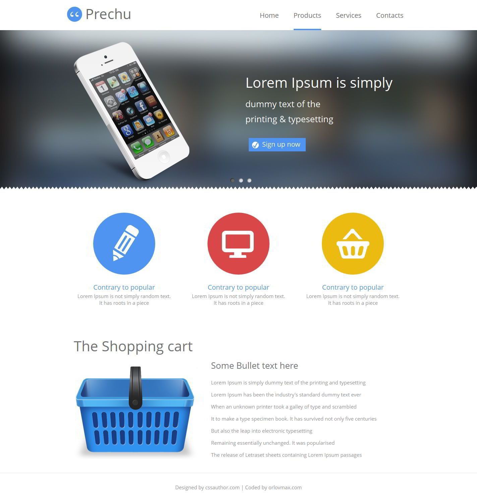
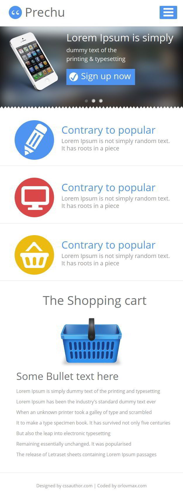

Free simple-product website template
======
Light and simple responsive website template, designed by cssauthor.com
###### Powered by html5, css3 and less css. Also used simple lesscss fluid grid.
More about this grid [here](https://github.com/orlovmax/fluid-less-grid)
###### Compatible Browsers: IE8+, Firefox, Chrome, Opera, Safari, Yandex.browser
Demo
------
You can see live demo here: [http://orlovmax.com/freebies/simple-product_website-template](http://orlovmax.com/freebies/simple-product_website-template "simple-product website live demo")

Please note
---
In reset.css most of elements `box-sizing` sets to `border-box`. 

Screenshots
---
**Width 1440px (without scrollbar)**

---

**Width 640px (without scrollbar)**

---